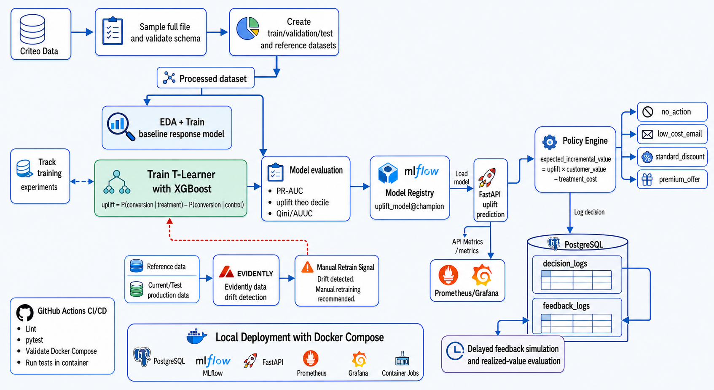
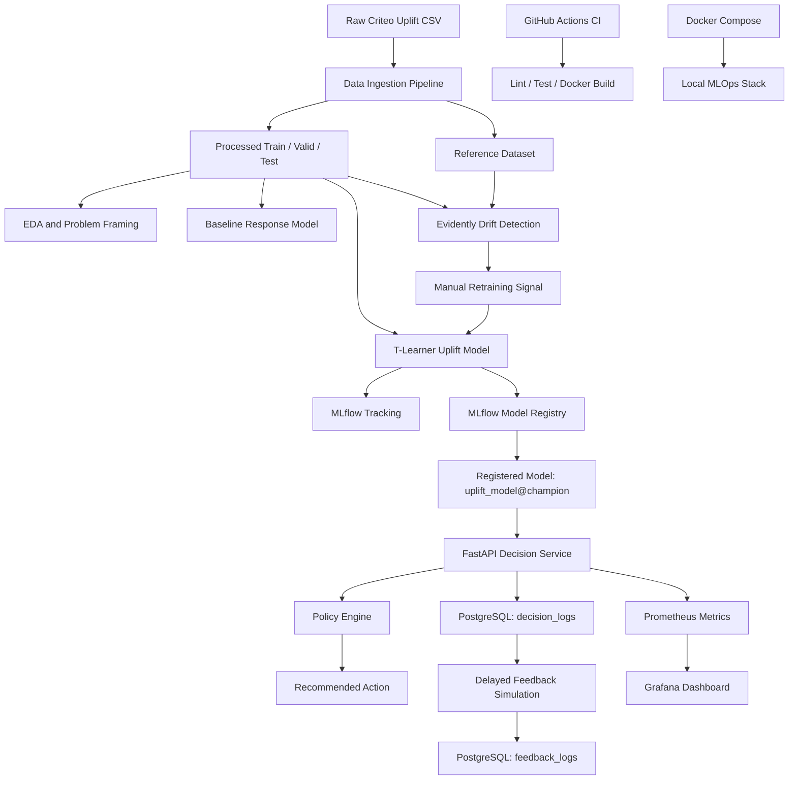

# RetentionOps Architecture

RetentionOps is an end-to-end uplift modeling and MLOps project for retention decisioning.

The system estimates whether a user should receive an intervention by comparing predicted outcomes under treatment and control conditions.

## High-Level Flow

```text
Raw Criteo Uplift Data
→ Data Pipeline
→ Processed Dataset
├─→ EDA and Baseline Response Model
└─→ T-Learner Uplift Model
   → Evaluation → MLflow Model Registry
   → FastAPI Decision Service → Policy Engine
   → PostgreSQL decision_logs
   → Delayed Feedback Simulation
   → PostgreSQL feedback_logs

FastAPI /metrics → Prometheus → Grafana
Reference + Current Data → Evidently → Manual Retrain Signal
```

## Diagrams

Diagrams are stored in the `diagrams/` directory.

The corrected end-to-end diagram is also embedded in the root [README](../README.md):



### High-Level Architecture



## Core Components

### Data Pipeline

The data pipeline reads the raw Criteo uplift dataset, samples across the full file, validates schema, and creates train, validation, test, and reference datasets. The reference file is a snapshot of the training data used by drift reports; it is not a second production dataset.

Important design choice:

> Do not read only the first N rows from the raw CSV.
> 
> The raw dataset can be ordered by treatment assignment. Sampling across the full file is required to preserve both treatment and control groups.

### Modeling

The project includes two modeling stages:

| Phase | Model | Purpose |
|-------|-------|---------|
| Phase 3 | Response model | Predict `P(conversion \| treatment = t, features)` |
| Phase 4 | T-Learner uplift model | Predict treatment effect |

The uplift score is:

```text
uplift_score = P(conversion | treatment = 1, features) - P(conversion | treatment = 0, features)
```

### Policy Engine

The model does not directly decide actions. The policy engine converts uplift score into business value:

```text
expected_incremental_value = uplift_score * customer_value - treatment_cost
```

It then recommends one of:

- `no_action`
- `low_cost_email`
- `standard_discount`
- `premium_offer`

### Serving

The FastAPI service exposes:

| Endpoint | Purpose |
|----------|---------|
| `GET /health` | Health check |
| `GET /model-info` | Current model alias and URI |
| `POST /decide-action` | Predict uplift and recommend action |
| `GET /metrics` | Prometheus metrics |

### Logging

Each decision is stored in PostgreSQL:

- `decision_logs`

Simulated delayed feedback is stored in:

- `feedback_logs`

### Monitoring

Prometheus scrapes FastAPI metrics from:

- `/metrics`

Grafana displays:

- API request rate
- API latency
- API errors
- Recommended action distribution
- Average uplift score
- Average expected incremental value

### Drift Detection

Evidently compares:

- `reference dataset`
- vs
- `current or simulated production dataset`

and generates:

- drift report
- feature-level drift summary
- retraining signal

The current implementation reports a retraining recommendation; it does not automatically launch a new training run. The default retraining rule fires when dataset drift is detected, when more than 30% of features are drifted, or when critical features are configured as drifted.

### Local Stack

Docker Compose runs:

| Service | Purpose |
|---------|---------|
| `postgres` | Decision and feedback logs |
| `mlflow` | Tracking and Model Registry |
| `api` | FastAPI Decision Service |
| `prometheus` | Metrics scraping |
| `grafana` | Dashboards |
| `jobs` | One-off training, registration, drift and feedback jobs |
